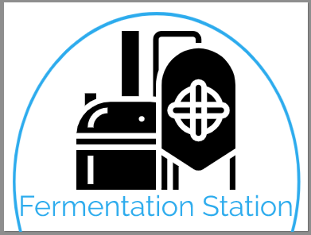

# Fermentation Station

---

Welcome to **Fermentation Station**. A place where people who love the taste of **Craft Beer** and **Beer Infused Food Produce** can come and find the products they enjoy. 

## UX
---

### User Stories 

*Generic User*

* As a user, I want to be able to **learn** about a variety of Craft Beers and Beer Infused Food Produce. 

* As a user, I want to be able to **keep up to date** about my favourite Craft Beers and Beer Infused Food Produce from the list of products. 

* As a user, I want to be able to **request** my favourite Craft Beers and Beer Infused Food Produce be added to the site. 

* As a user, I want to be able to **Add** my favourite Craft Beers and Beer Infused Food Produce to a shopping cart and check out. 

*Developers Goals* 

* As a developer, I want to be able to create a usable app. 

* As a developer, I want to be able to increase the passion for Craft Beers and Beer Infused Food Produce.

### Design 

1. **Logo** 
The logo was created using [Free Logo Maker](https://logomakr.com). It was designed to to show the love for beer and symbolise the process of making beer. 

2. **Colour Scheme**

The colours for the website were chosen using [Coolors](https://coolors.co/). They were chosen with the aim to represent the Fermentation Brand and the love that goes into it. The chosen colours are:

3. **Fonts**

The website has the main font of Roboto Slab, which was chosen due to it **readability to all users**. Furthermore, it modern which will fit with the aim of the website. It was chosen using [Google Fonts](https://fonts.googleapis.com/css2?family=Roboto+Slab&display=swap) and has the default of Sans Serif. 

4. **Wireframes**

The wireframes for this website where created using [Balsamiq](https://balsamiq.com/wireframes/?gclid=CjwKCAjwltH3BRB6EiwAhj0IUBrAHe-2BiRjQmQGSO-FZIjoEjkckL_kVyJXd5ShGVwKqDaDMqKjvBoCQksQAvD_BwE)

